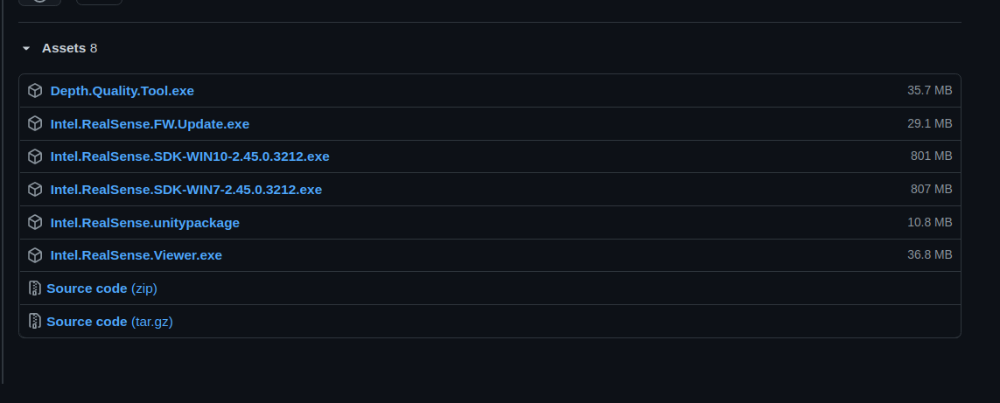
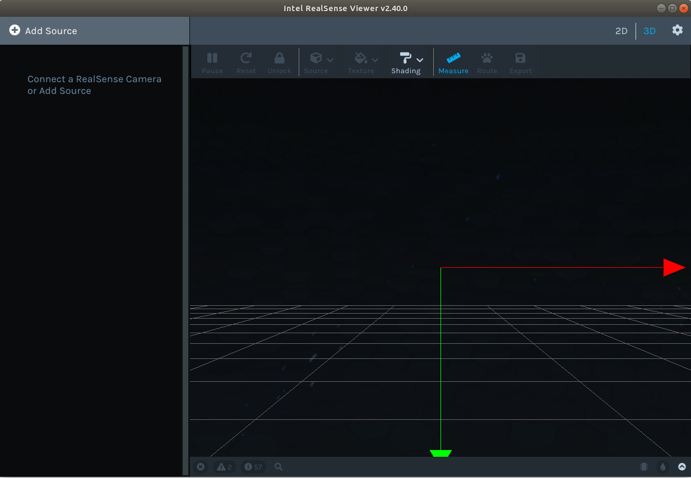

# Realsense Setup Recording Documentation

Some references:

D435i Manual : https://www.intel.com/content/dam/support/us/en/documents/emerging-technologies/intel-realsense-technology/Intel-RealSense-Viewer-User-Guide.pdf

Realsense Documentation : https://dev.intelrealsense.com/docs/docs-get-started

# Download Realsense Viewer

In order to be able to use the camera setup, one needs official drivers. You can use the libraries and write your own code, or you can use the official software (Realsense-Viewer) that does the work for you. But one downside of this approach is that you lose some flexibility.

To download the official software, Realsense Viewer please Google "Realsense viewer".
Or you might find the latest version of the software from the following link hopefully.

https://github.com/IntelRealSense/librealsense/releases/

Then after finding the suitable version, probably the latest stable one, proceed to download Intel.Realsense.Viewer.exe. Note that you do not have to install it, it works out of the box once you downloaded it.

# Connect to the cameras

In the software, after connecting the usb cables of the cameras to your PC, your cameras should be visible at the left-side. If they are not you can click to Add Source button and choose manually. We suggest that you connect the D435i to a **USB3** port, while T265 is fine with a USB2 port. 

# Overview of Settings in the Software

The settings might seem complicated at first but they are straight forward. Try different settings and use the one suits you. But beware that the FPS and resolution is not free. Selecting high FPS or resolution might result in drop in frames and sometimes no frames at all. 

Here is a link to a github issue discussion we had for this issue. We could not get consistent frames and they were dropping. Moral of the story is that you might try to use dynamic calibration tool, the link is given in the end of the issue.

Issue Link : https://github.com/IntelRealSense/librealsense/issues/7621

Note that, for our laptop, it is a moderate one (i5 8265u, mx130 graphics card, 8gb ddr4 ram, ssd(helps with keeping up to recording speed) ), we used the following FPS and resolution settings;

## D435i :  15 FPS
    Depth resolution: 1280 x 720
    Color resolution : 848 x 480 (you might try to increase this one, our laptop dropped images if we increased the resolution for color)
## T265 : 30 FPS
    Resolution : 848 x 800

Note that we also recorded accelerometer and pose informations coming from T265.

# Make a Recording

In order to record from the cameras, it is sufficient to only click to RECORD button on top left. You will need to press this button for both of the cameras. Please note that recordings can get big very quick, to give an idea 372 MB in 6 seconds (1280x720 Depth and gyros). Also note that you can replay these recordings from the software.

# Converting Ros-bag files to CSV format

The format of the records is rosbag, which is not very well known, at least to us. But we manage to find a code that convert this format to CSV so that we could use known libraries to do processing on these recordings. 

There is extractor.py file that reads specified bag files and converts them to CSV files. Here is the directory structure you should have run this file:

    Records

        | ---- targetRecords.txt
        | ---- activeCsv
    
    extractor.py
    fetcher.py

You should add the files of the target bag files that you want to convert to **targetRecords.txt**

* Please note that after inserting the name of a target bag file, do not forget to add a new line by pressing to enter button.

Then you should run extractor.py file. Note that the target bag files need to stay in same directory with the extractor file, you can change this from the code obviously.

The script will convert the bag file to csv files and will write it into Records/activeCsv directory using the same name of the bag file. It will create a directory and populate inside with csv files.

fetcher.py file is given for reference, you can see how we use panda library to read from these csv files and obtain python objects of the records. Of course you can totaly ignore this file and write your own code to read csv files.

Please note that in order be able to run extractor.py, you will need to install rosbag package
To install rosbag package:
#### conda install -c conda-forge ros-rosbag
Also for fetcher.py you will need pandas package.
To install pandas package
#### conda install pandas

